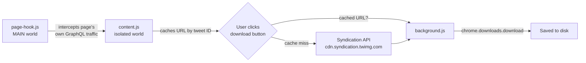

# X/Twitter Video Downloader

> One-click video downloads for X/Twitter. No Python, no yt-dlp process, no local server — just a browser extension.

A Chrome/Brave (MV3) extension that adds a download button next to videos on `x.com` / `twitter.com`. It reads video URLs straight out of the page's own network traffic, with a public-API fallback, and saves files through the browser's native downloads API.

## Contents

- [How it works](#how-it-works)
- [Modes](#modes)
- [Install](#install)
- [Configuration](#configuration)
- [Project structure](#project-structure)
- [Why this architecture](#why-this-architecture)
- [Known limitations](#known-limitations)
- [Troubleshooting](#troubleshooting)
- [References & acknowledgments](#references--acknowledgments)

## How it works

There's no backend. Two cooperating data paths resolve a tweet ID to a downloadable `.mp4` URL:



**Primary path — page interception.** A script injected into the page's own JS context (`"world": "MAIN"`) patches `window.fetch` and `XMLHttpRequest` to watch X's internal GraphQL responses as they load. It recursively scans each response for tweet objects carrying video media and relays any URLs it finds to the extension's isolated content script via `window.postMessage`. Because this reads data from your own authenticated session, it works on protected/private tweets too.

**Fallback path — public syndication API.** If a tweet's data wasn't captured (e.g. you clicked before the relevant request fired), the background script computes a token from the tweet ID and queries X's public, unauthenticated syndication endpoint — the same one libraries like Vercel's `react-tweet` use to embed tweets without the official API. Public tweets only.

Either way, X serves tweet videos as already-muxed progressive MP4s, so no `ffmpeg` merge step is needed — `chrome.downloads.download()` saves the file directly.

## Modes

Set from the toolbar popup. Changes apply immediately on every open tab — no reload required.

| Mode | Behavior | Tradeoff |
|---|---|---|
| **Hybrid** *(default)* | Page interception first, syndication fallback on cache miss | Best success rate |
| **Intercept only** | Page interception only, no fallback | Zero public API calls; fails on cache miss |
| **Syndication only** | Never patches `fetch`/`XHR` at all | Lowest footprint, public tweets only |

<details>
<summary>Why mode switching needs a little extra plumbing</summary>

`page-hook.js` runs in the page's own JS context, which has no access to `chrome.storage`. The popup writes your chosen mode to `chrome.storage.sync`; `content.js` mirrors it into `localStorage` (synchronously readable from both worlds) and `postMessage`s it to the page immediately, so `page-hook.js` can enable/disable its patch in real time — fully reversible, not just toggled on or off at install time.

</details>

## Install

1. Clone or download this repo
2. Open `chrome://extensions` (or `brave://extensions`)
3. Enable **Developer mode**
4. Click **Load unpacked** → select the project folder
5. Open `x.com` or `twitter.com` — video tweets get a download icon in the action bar

Requires Chrome 111+ or an equivalent Brave release (for the static `"world": "MAIN"` content script declaration).

## Configuration

Click the toolbar icon to set:

- **Mode** — see [Modes](#modes) above
- **Download subfolder** — relative to your default Downloads folder (default: `XVideos`)

## Project structure

```
.
├── manifest.json
├── background/              # Service worker — ES modules
│   ├── index.js              # Entry point: message listener
│   ├── resolve.js             # Mode-aware decision logic
│   ├── storage.js             # chrome.storage reads
│   ├── syndication.js         # Public API client
│   ├── token.js                # Syndication token formula
│   └── downloads.js            # Dedup + chrome.downloads
├── page-hook/                # MAIN world — shared namespace: window.__XDL__
│   ├── 01-core.js              # Save original fetch/XHR refs
│   ├── 02-extractor.js          # JSON tree walker
│   ├── 03-hook-control.js       # enable/disableHook()
│   └── 04-bootstrap.js           # Initial mode + hot-switch listener
├── content/                  # Isolated world — shared namespace: window.__XDL_CONTENT__
│   ├── 01-namespace.js
│   ├── 02-mode-sync.js
│   ├── 03-video-cache.js
│   ├── 04-tweet-detector.js
│   ├── 05-button-ui.js
│   ├── 06-download-flow.js
│   ├── 07-bootstrap.js
│   └── content.css
├── popup/
│   ├── popup.html
│   ├── popup.css
│   └── popup.js
├── shared/
│   └── constants.js           # Imported by background/* only
└── icons/
```

## Why this architecture

MV3 service workers support `"type": "module"`, so `background/` uses real `import`/`export`. Content scripts don't support ES modules — each file in a `content_scripts.js` array runs as a separate classic script, executed in order, sharing one global scope. `page-hook/` and `content/` lean into that: every file attaches its exports to a single namespace object (`window.__XDL__` or `window.__XDL_CONTENT__`) instead of polluting the global scope directly. Numeric file prefixes (`01-`, `02-`, …) just make the enforced load order legible — the real ordering guarantee comes from the `js` array in `manifest.json`.

## Known limitations

- X-specific only — not a general-purpose downloader
- Depends on `extended_entities.media[].video_info.variants` staying stable in X's data model, and/or the syndication token formula staying valid — both are unofficial and could break if X changes internals
- If X changes its DOM structure for tweets or the action bar, the selectors in `content/04-tweet-detector.js` and `content/07-bootstrap.js` may need updating
- Page interception only sees traffic on tabs where the content script is active

## Troubleshooting

| Symptom | Likely cause |
|---|---|
| No download button appears | X changed its DOM structure — check selectors in `04-tweet-detector.js` |
| "No cached video URL" error in Intercept-only mode | The tweet's data wasn't fetched yet — reopen the tweet, or switch to Hybrid |
| Download fails in Syndication-only mode | Tweet is private/protected, or the syndication endpoint/token formula changed |
| Duplicate files for one click | Should be fixed via `Set`-based dedup in `02-extractor.js` — please file an issue with the tweet URL if it recurs |

## References & acknowledgments

There are the public techniques, APIs, and prior art this project's design draws on, listed for attribution and so anyone auditing the extension knows where to verify each claim independently.

- **[react-tweet](https://github.com/vercel/react-tweet)** (Vercel, MIT license) — the syndication CDN token formula in `background/token.js` (`((id / 1e15) * Math.PI).toString(36)…`) is the same publicly known algorithm this library uses to fetch tweet data from `cdn.syndication.twimg.com` without the official paid API.
- **Twitter/X's internal API data shape** — the `extended_entities.media[].video_info.variants` structure that both `page-hook/02-extractor.js` and `background/syndication.js` parse is part of Twitter's long-standing (legacy v1.1-era) JSON format, which is still embedded in X's modern GraphQL responses. This isn't owned by any single source — it's been independently observed and documented across the broader Twitter-scraping ecosystem over the years, including projects like [gallery-dl](https://github.com/mikf/gallery-dl), [snscrape](https://github.com/JustAnotherArchivist/snscrape), and [twint](https://github.com/twintproject/twint).
- **[Chrome Extensions documentation](https://developer.chrome.com/docs/extensions)** — Manifest V3 concepts used throughout: content script worlds (`"world": "MAIN"` vs. isolated), the `chrome.storage`, `chrome.downloads`, and `chrome.notifications` APIs, and ES module support (`"type": "module"`) in service workers.
- **[MDN Web Docs](https://developer.mozilla.org/)** — standard reference for the web platform APIs the page hook depends on: `fetch`, `XMLHttpRequest`, `MutationObserver`, and `window.postMessage`.